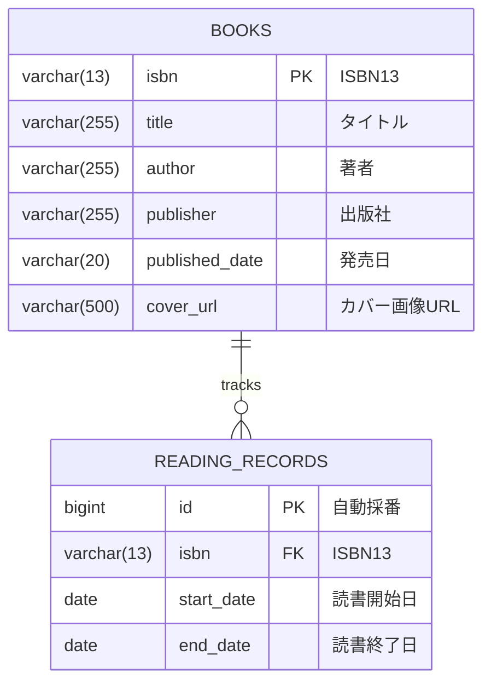

# DB論理設計ER図

```mermaid
erDiagram
    BOOKS ||--o{ READING_RECORDS : "tracks"
    BOOKS {
        varchar(13) isbn PK "ISBN13"
        varchar(255) title "タイトル"
        varchar(255) author "著者"
        varchar(255) publisher "出版社"
        varchar(20) published_date "発売日"
        varchar(500) cover_url "カバー画像URL"
    }
    READING_RECORDS {
        bigint id PK "自動採番"
        varchar(13) isbn FK "ISBN13"
        date start_date "読書開始日"
        date end_date "読書終了日"
    }
```
