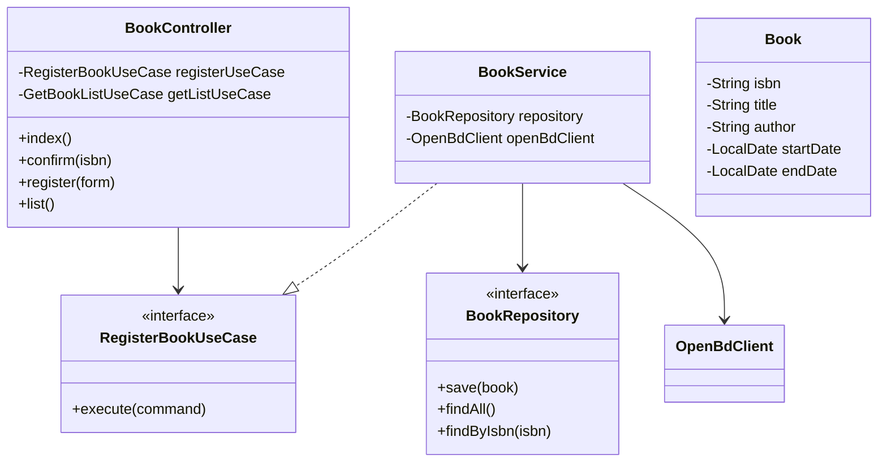

# クラス図

```mermaid
classDiagram
    class BookController {
        -RegisterBookUseCase registerUseCase
        -GetBookListUseCase getListUseCase
        +index()
        +confirm(isbn)
        +register(form)
        +list()
    }

    class RegisterBookUseCase {
        <<interface>>
        +execute(command)
    }

    class BookRepository {
        <<interface>>
        +save(book)
        +findAll()
        +findByIsbn(isbn)
    }

    class BookService {
        -BookRepository repository
        -OpenBdClient openBdClient
    }

    class Book {
        -String isbn
        -String title
        -String author
        -LocalDate startDate
        -LocalDate endDate
    }

    BookController --> RegisterBookUseCase
    BookService ..|> RegisterBookUseCase
    BookService --> BookRepository
    BookService --> OpenBdClient
```
