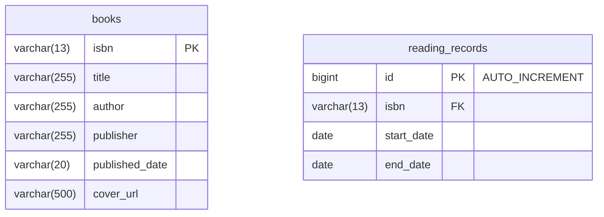

# DB物理設計ER図

```mermaid
erDiagram
    books {
        varchar(13) isbn PK
        varchar(255) title
        varchar(255) author
        varchar(255) publisher
        varchar(20) published_date
        varchar(500) cover_url
    }
    reading_records {
        bigint id PK "AUTO_INCREMENT"
        varchar(13) isbn FK
        date start_date
        date end_date
    }
```

## インデックス
- `reading_records.isbn`: 外部キー、検索の高速化のため。
