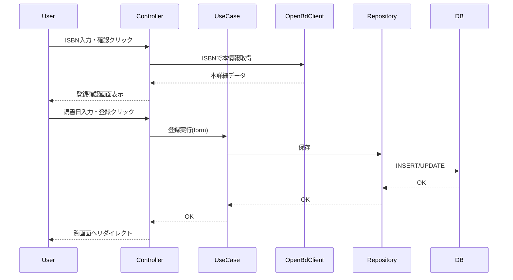

# シーケンス図 (本登録)

```mermaid
sequenceDiagram
    participant User
    participant Controller
    participant UseCase
    participant OpenBdClient
    participant Repository
    participant DB

    User->>Controller: ISBN入力・確認クリック
    Controller->>OpenBdClient: ISBNで本情報取得
    OpenBdClient-->>Controller: 本詳細データ
    Controller-->>User: 登録確認画面表示
    User->>Controller: 読書日入力・登録クリック
    Controller->>UseCase: 登録実行(form)
    UseCase->>Repository: 保存
    Repository->>DB: INSERT/UPDATE
    DB-->>Repository: OK
    Repository-->>UseCase: OK
    UseCase-->>Controller: OK
    Controller-->>User: 一覧画面へリダイレクト
```
