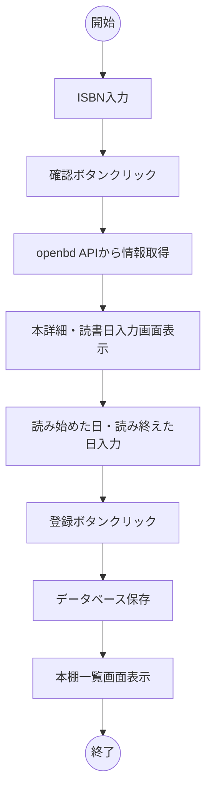

# 業務フロー図

```mermaid
graph TD
    Start((開始)) --> InputISBN[ISBN入力]
    InputISBN --> ClickConfirm[確認ボタンクリック]
    ClickConfirm --> FetchAPI[openbd APIから情報取得]
    FetchAPI --> ShowDetails[本詳細・読書日入力画面表示]
    ShowDetails --> InputDates[読み始めた日・読み終えた日入力]
    InputDates --> ClickRegister[登録ボタンクリック]
    ClickRegister --> SaveDB[データベース保存]
    SaveDB --> ShowList[本棚一覧画面表示]
    ShowList --> End((終了))
```
