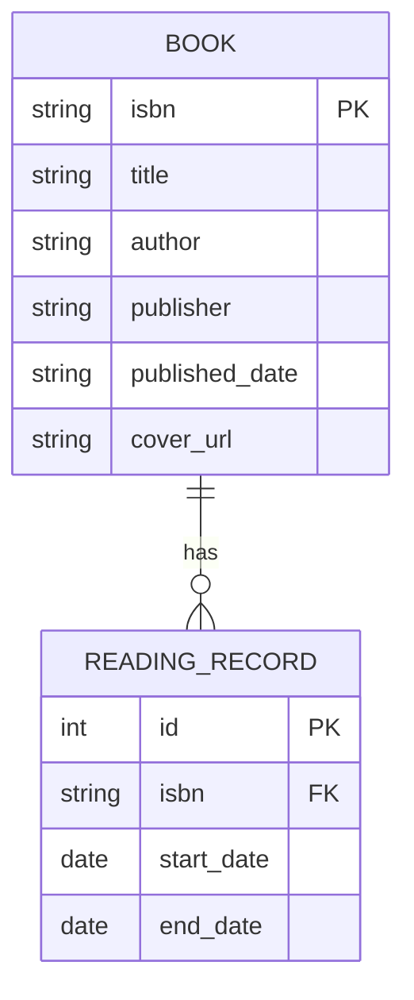

# DB概念設計ER図

```mermaid
erDiagram
    BOOK ||--o{ READING_RECORD : "has"
    BOOK {
        string isbn PK
        string title
        string author
        string publisher
        string published_date
        string cover_url
    }
    READING_RECORD {
        int id PK
        string isbn FK
        date start_date
        date end_date
    }
```
